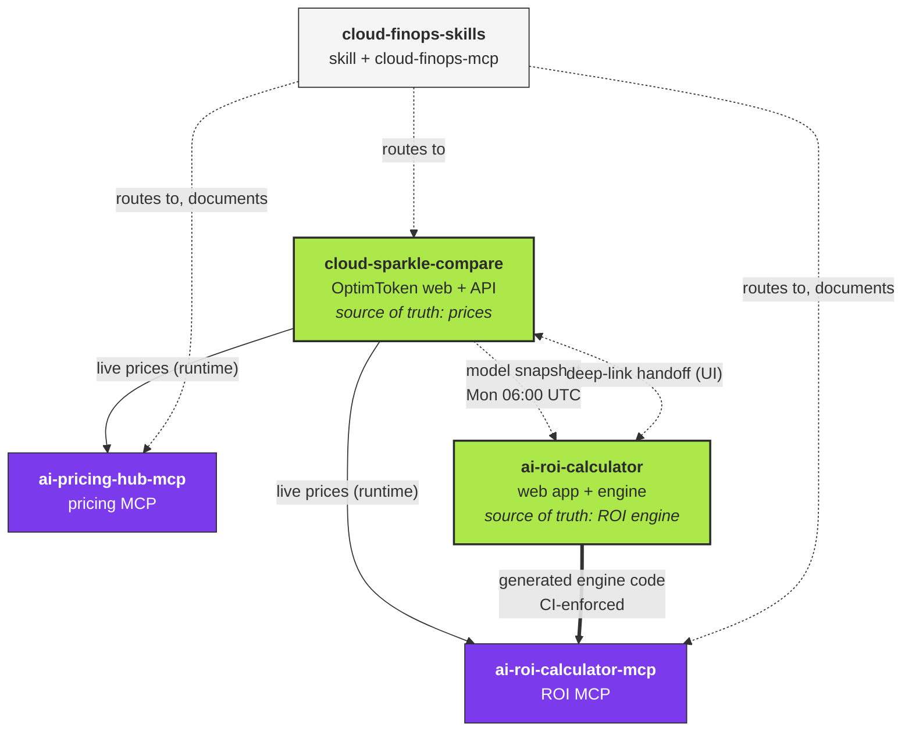

# Dependency map

Five OptimNow repositories make up the FinOps tooling family. They are separate
repos on purpose, but they are not independent: prices flow from one of them into
all the others, and one pair shares generated code.

This file answers two questions. What depends on what, and **if I change this repo,
what else do I need to look at?**

---

## The five repositories

| Repository | What it is | Runtime | Deployed as |
|---|---|---|---|
| [`cloud-sparkle-compare`](https://github.com/OptimNow/cloud-sparkle-compare) | **OptimToken** - the price catalogue, web app and public API | Node / Vite / React | [optimtoken.optimnow.io](https://optimtoken.optimnow.io) on Vercel |
| [`ai-pricing-hub-mcp`](https://github.com/OptimNow/ai-pricing-hub-mcp) | OptimToken as MCP tools | Node / Skybridge | Alpic |
| [`ai-roi-calculator`](https://github.com/OptimNow/ai-roi-calculator) | AI ROI calculator web app, and the **engine + METHODOLOGY.md** | Node / React | [airoicalculator.optimnow.io](https://airoicalculator.optimnow.io) |
| [`ai-roi-calculator-mcp`](https://github.com/OptimNow/ai-roi-calculator-mcp) | The ROI calculator as MCP tools | Node / Skybridge | Alpic |
| [`cloud-finops-skills`](https://github.com/OptimNow/cloud-finops-skills) | This repo. FinOps knowledge, and `cloud-finops-mcp` | Python | PyPI + Alpic |

Two of them are **sources of truth**. Everything else consumes them:

- **OptimToken** is the single source for every price figure in the family.
- **`ai-roi-calculator`** is the single source for the ROI engine and its methodology.

---

## The map

Read the arrow weight as coupling strength:

- **`==>` generated code.** `ai-roi-calculator-mcp` contains a copy of the calculator's
  engine, produced by `scripts/sync-engine.mjs`. Its CI checks out
  `OptimNow/ai-roi-calculator` on **every PR** and fails if the copy has drifted. This is
  the tightest coupling in the family, and the only one that can fail a build.
- **`-->` runtime fetch.** The MCP servers call the OptimToken API when a tool runs. A
  change to the API response shape breaks them at request time, not at build time, which
  means CI will not catch it.
- **`-.->` scheduled data pull.** A snapshot copied on a cron, not a live call.
- **`-..->` documentation only.** `cloud-finops-skills` names these tools and tells the
  model to call them. There is no code dependency in either direction: nothing in this
  repo imports, builds against, or calls them at build time.

---

## The Monday cascade

Price data propagates on a deliberate one-hour stagger. Each job runs after the one it
depends on.

| Time (UTC) | Repository | Job | What it does |
|---|---|---|---|
| Daily 05:00 | `cloud-sparkle-compare` | `refresh-llm-fallback` | Refreshes the OptimToken catalogue |
| Mon 05:30 | `cloud-sparkle-compare` | `refresh-bedrock-matrix` | Refreshes the Bedrock matrix |
| Mon 06:00 | `ai-roi-calculator` | `refresh-model-snapshot` | Pulls the model snapshot from OptimToken |
| Mon 07:00 | `ai-roi-calculator-mcp` | `sync-engine` | Pulls engine + snapshot from the calculator |

**`ai-pricing-hub-mcp` is not on this cascade.** Its static fallback catalogue is
regenerated only by running `npm run refresh-fallback` by hand. That matters, because the
fallback is what gets served whenever the live fetch fails, and an unrefreshed fallback
ages silently. Check its `dataAsOf` before trusting a tier-2 response.

---

## If I change this repo, what else do I review?

The table is ordered by blast radius, widest first.

### `cloud-sparkle-compare` (OptimToken)

The riskiest repo in the family: everything downstream reads it.

| If you change | Also review | Why |
|---|---|---|
| An API **response shape** (`/api/llm-models`, `/api/pricing`) - renamed field, changed nesting, changed `meta` block | `ai-pricing-hub-mcp`, `ai-roi-calculator-mcp` | Both parse these responses at runtime. Nothing fails at build time, so the first symptom is a tool silently falling back to stale data |
| An API **URL or route** | Both MCP repos, plus `ai-roi-calculator` | Hard break |
| Cache TTLs, timeouts, payload size | `ai-pricing-hub-mcp` | Its client timeout is tuned against these response times |
| Prices or catalogue contents only | Nothing | This is the normal case and propagates by design |

### `ai-roi-calculator`

| If you change | Also review | Why |
|---|---|---|
| Anything under the engine (formulas, presets, constants) | **`ai-roi-calculator-mcp` - mandatory** | Its CI fails until `npm run sync:engine` is re-run there and the result committed. Do not merge one without the other |
| `METHODOLOGY.md` semantics - a method's definition, an input's meaning, a documented trap | `cloud-finops-skills` -> `references/finops-ai-value-management.md` | That reference explains the same methods in prose. It deliberately holds no formulas, but it does describe what each input means |
| Wording, UI, styling | Nothing | |

### `ai-roi-calculator-mcp`

| If you change | Also review | Why |
|---|---|---|
| Anything in `server/src/lib/` | **Stop** | It is generated. Change `ai-roi-calculator` instead, then re-sync |
| Tool names, signatures, or output shape | `cloud-finops-skills` -> `INSTALLATION.md` | The companion-connector section lists the four tools and their parameters |
| The deployment URL | `cloud-finops-skills` -> `INSTALLATION.md` | The connect command is published there |

### `ai-pricing-hub-mcp`

| If you change | Also review | Why |
|---|---|---|
| The `provenance` block - tier semantics, field names, the stale notice | `cloud-finops-skills` -> `SKILL.md` / `POWER.md` "Price figures" rule 5, and `INSTALLATION.md` | The skill's dated-price doctrine instructs the model to read those exact fields |
| Tool names, signatures, output shape | `cloud-finops-skills` -> `SKILL.md`, `POWER.md`, `INSTALLATION.md` | Tool names appear in the doctrine and the routing |
| The deployment URL | `cloud-finops-skills` -> `README.md`, `INSTALLATION.md` | Published in both |
| The static fallback catalogue | Nothing, but check `dataAsOf` | See the cascade note above |

### `cloud-finops-skills` (this repo)

The safest repo to change: **nothing downstream depends on it.** The dependencies run
inward.

| If you change | Also review | Why |
|---|---|---|
| Reference or playbook content | Nothing outside this repo | The intra-repo build hook re-bundles it into `cloud-finops-mcp` automatically |
| The MCP tool surface (`mcp_server/src/`) | Nothing outside this repo | But bump versions per the release-train rule in `CLAUDE.md` |
| Text that quotes another repo's tool names, URLs, or provenance fields | Verify against that repo | This is drift in the inward direction: the other repo changed and this one did not follow |

---

## Known asymmetries

Worth carrying in your head when reviewing anything here.

1. **Runtime coupling is invisible to CI.** Only the ROI calculator to ROI MCP edge is
   enforced by a build. Every other cross-repo edge is a runtime fetch or a piece of
   documentation, so a breaking change ships green and surfaces as a degraded answer.
2. **This repo's dependencies are documentation, and documentation drifts silently.**
   Tool names, parameters, endpoint URLs and provenance field names are quoted in
   `SKILL.md`, `POWER.md`, `INSTALLATION.md` and `README.md`. Nothing checks them. When
   an MCP repo changes its surface, this repo does not find out.
3. **Duplicated computation is the recurring failure mode in this family.** OptimToken
   drifted between its website and its MCP; the ROI calculator drifted between its web
   app and its MCP far enough to return a 7-point different ROI for the same preset. The
   generated-and-CI-checked sync exists because of the second one. Before adding a
   capability to a second repo, check whether it can route to the first instead. The
   reasoning behind the standing decision not to put pricing tools inside
   `cloud-finops-mcp` is in the Roadmap section of `CLAUDE.md`.

---

> *Cloud FinOps Skill by [OptimNow](https://optimnow.io) - licensed under [CC BY-SA 4.0](https://creativecommons.org/licenses/by-sa/4.0/).*
