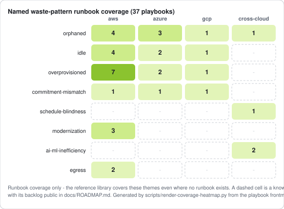

# Cloud FinOps Skill & MCP

> Open-source FinOps knowledge skill and MCP server for AI agents - Claude, ChatGPT,
> Gemini, Cursor, and any MCP-compatible client. Cloud cost optimisation across AWS,
> Azure, GCP and OCI, AI cost management and inference economics, Kubernetes, data
> platforms, allocation, chargeback, anomaly management, and named-pattern waste
> detection playbooks.
> Built by [OptimNow](https://optimnow.io), grounded in enterprise delivery experience.

[](https://github.com/OptimNow/cloud-finops-skills/stargazers)
[](https://pypi.org/project/cloud-finops-mcp/)
[](https://github.com/OptimNow/cloud-finops-skills/releases/latest)
[](https://www.finops.org/framework/)
[](https://agentskills.io/specification)
[](https://kiro.dev/docs/powers/installation/)
[](https://creativecommons.org/licenses/by-sa/4.0/)

---

## Install in 5 seconds

| Tool | One-step install |
|---|---|
|  | At the Claude Code prompt: `/plugin marketplace add https://github.com/OptimNow/cloud-finops-skills.git` then `/plugin install cloud-finops@optimnow` |
|  | [Download the latest release zip](https://github.com/OptimNow/cloud-finops-skills/releases/latest), then **Settings -> Skills -> Upload zip** |
|  | Self-host: `./install.sh --tool chatgpt --grouped` _(a public Cloud FinOps GPT is on the Roadmap)_ |
|  | Self-host: `./install.sh --tool gemini` _(a public Cloud FinOps Gem is on the Roadmap)_ |
|        | One-liner: `curl -sL https://raw.githubusercontent.com/OptimNow/cloud-finops-skills/main/install.sh \| bash -s -- --tool <name>` |
|  | `curl -sL https://raw.githubusercontent.com/OptimNow/cloud-finops-skills/main/install.sh \| bash` |
|  | Nothing to install: `claude mcp add --transport http cloud-finops https://cloud-finops-skills-590a051d.alpic.live/`. For Claude.ai / Desktop, **Settings -> Connectors -> Add custom connector** with exactly that URL (trailing slash included - the widget sandbox domain is derived from it) |
|  | `pip install cloud-finops-mcp` then add to your MCP client config (Claude Code / Cursor / Codex / Windsurf / Cline). Snippets: `./install.sh --tool mcp`. Six tools - faceted retrieval over the reference library and named-pattern playbooks. |

Full options, troubleshooting, and the model-agnostic API loader: see [INSTALLATION.md](./INSTALLATION.md).

### Live prices come from OptimToken, not from this repo

This skill carries billing **mechanics**, which stay true for years. It deliberately does
not carry current price **figures**, which go stale inside a packaged skill within weeks.

Those live in **[OptimToken](https://optimtoken.optimnow.io)** - LLM token rates for 250+
models and compute instance rates across seven clouds, each figure carrying its own as-of
date. The website works on its own with no setup. Adding its MCP connector lets the model
fetch a rate mid-answer instead of telling you to go and look it up:

| | |
|---|---|
|  | [optimtoken.optimnow.io](https://optimtoken.optimnow.io) - compare model and instance prices in the browser |
|  | Hosted, nothing to install. Point your client at `https://ai-pricing-hub-mcp-9604f763.alpic.live/` - config snippets in [INSTALLATION.md](./INSTALLATION.md#companion-connector-optimnow-ai-pricing-hub-optional) |

Pair it with the skill and a pricing question gets answered with a dated figure and its
source, rather than from a number the model remembers.

---

## What is a Skill, and why does it matter

A Skill is a structured knowledge file that you attach to an AI agent or a large language
model. It gives the model accurate, domain-specific context that it would not otherwise
have access to.

Without it, general-purpose LLMs make confident but incorrect statements on FinOps topics.
They miscalculate PTU break-even rates. They confuse Azure and AWS reservation mechanics.
They give generic advice that ignores how billing actually works on Bedrock or Azure OpenAI.
The answers sound plausible. Most of the time, they are wrong on the details that matter.

This skill corrects that by injecting verified, curated FinOps knowledge directly into the
model's context - covering billing models, cost allocation patterns, optimisation
frameworks, and governance practices across the major cloud providers and AI platforms.

**The closest analogy is RAG (Retrieval-Augmented Generation).** Like RAG, it extends a
model's knowledge beyond its training data. Unlike RAG, it requires no vector database,
no embedding pipeline, and no retrieval infrastructure. You copy a folder into your agent
setup and the model gains structured expertise on cloud financial management.

This makes it portable: the same skill works with Claude, GPT, Gemini, or any
MCP-compatible agent - with no changes to the files.

To keep responses consistent across models, add a **response contract** to your
system prompt (see `INSTALLATION.md`, "API integration / Recommended response
contract"). This ensures structured, billing-grounded answers even when model
defaults differ.

---

## Who this is for

- **FinOps practitioners** building or evaluating AI-assisted cost analysis tools
- **Cloud engineers and architects** who want a cost-aware assistant integrated into
  their workflow
- **Developers** building internal FinOps agents, chatbots, or automation pipelines
- **Finance and IT managers** evaluating the AI tooling their teams are deploying

No AI infrastructure experience is required to use this skill. If you can copy a folder
and follow the installation steps, you can add FinOps expertise to any compatible agent.

---

## Design principles

- **AI cost management is a first-class domain.** Most FinOps resources treat AI
  workloads as an edge case. This skill treats them as a primary concern, with
  dedicated reference files for each major AI platform.
- **Visibility before optimisation.** The skill follows a consistent sequence:
  establish what you are spending, understand what is driving it, then act. It does
  not recommend optimisation steps before the visibility preconditions are met.
- **Provider-mechanics-first, vendor-claim-skeptical.** Guidance is grounded in how
  billing actually works (CUR columns, Azure cost-management semantics, BigQuery
  export, FOCUS conformance) rather than in vendor marketing or framework
  positioning. Vendor sustainability and savings claims are read critically, with
  primary sources cited.
- **Maturity is contextual, not aspirational.** Verticals where cloud is not a
  revenue generator do not need to reach Run; Crawl plus selective Walk is the right
  state when cloud is a cost centre. Verticals where cloud IS the product need Run
  because cloud efficiency directly drives gross margin. Pushing every organisation
  toward the same maturity ceiling is malpractice.
- **Connect cost to business value.** Every recommendation answers the CFO test:
  what business outcome does this protect or unlock. Cost reduction without a value
  lens is a leak.
- **Mechanics live here, price figures do not.** Billing mechanics are durable and are
  what the reference files carry. Absolute prices are volatile, and a figure frozen in a
  markdown file goes stale within weeks with nothing in the distribution chain to correct
  it. So the skill routes current-price questions to a live source - the
  [OptimNow AI Pricing Hub](https://optimtoken.optimnow.io), which serves LLM token rates
  and compute instance rates across seven providers, each with its own as-of date - and
  states the date and source on any figure it does quote.
- **FinOps is an operating discipline, not a culture.** The discipline lives in
  allocation, anomaly management, commitment management, rightsizing, and
  governance, all of which produce measurable outputs. "Culture of FinOps" framing
  tends to substitute slideware for those outputs. In the agentic era this matters
  more, not less: agents execute discipline, not culture.

These principles will grow into a `skills/cloud-finops/doctrine/` directory of opposable
theses with their own primary sources.

---

## What this skill covers

The skill provides accurate, framework-aligned guidance across the following domains:

- **FinOps for AI** - LLM inference economics, token cost management, harness cost
  surface, unit economics for AI features, ROI frameworks, and AI cost governance
- **Agentic FinOps** - workflow vs pipeline vs true agent cost behaviour, agentic
  cost anatomy, cost-safe agent architecture, and agent-initiated payments (x402 / MPP)
- **AI value management** - AI Investment Council, stage gate model, incremental
  funding, practice operations, cross-functional governance for AI investments
- **GenAI capacity planning** - provisioned vs shared capacity, traffic shape analysis,
  spillover mechanics, throughput units, cross-provider comparison
- **Self-hosted vs managed AI inference** - decision framework for self-host vs managed LLM,
  hidden cost surface, ML-Ops maturity rubric, hybrid routing patterns (LiteLLM, Portkey)
- **Open-weight vendor hosted APIs** - DeepSeek, Qwen, Kimi and GLM sold direct: the three
  buying channels for one checkpoint, time-of-day pricing, cache and batch mechanics,
  licensing as a cost input, data residency as the channel selector
- **Anthropic billing** - Claude model pricing, Fast mode, long-context cliffs,
  prompt caching, Batch API, governance controls
- **AWS Bedrock** - model pricing, provisioned throughput, batch inference, cost allocation
- **Azure OpenAI Service** - PTU pool model, deployment locality, spillover mechanics,
  model modernisation, optimisation framework, use case economics, cost visibility
- **GCP Vertex AI** - Gemini pricing, provisioned throughput, batch prediction, cost visibility
- **AWS FinOps** - CUR setup, Cost Explorer, EC2 rightsizing, Reserved Instances vs
  Savings Plans, Enterprise Discount Program (EDP) negotiation, RDS cost management,
  multi-organisation billing, cost allocation, SCPs, and AWS-native quick wins
- **Azure FinOps** - Azure Cost Management, Reservations, Azure Policy, FinOps Toolkit,
  Azure Hybrid Benefit, EA-to-MCA transition impact, agentic FinOps (Copilot observability
  agent, ARM MCP Server, FinOps hubs AI agents), and Azure-specific optimisation patterns
- **GCP FinOps** - Compute Engine, Cloud SQL, GCS, BigQuery, networking optimisation
- **Tagging governance** - tag taxonomy design, naming conventions, IaC enforcement,
  virtual tagging, MCP-based automation, and compliance monitoring
- **FinOps Framework** - full FinOps Foundation framework, 22 capabilities, maturity model
- **Databricks** - cost data foundations (system.billing.usage, DBU executor patterns,
  DBCU commitments, Photon multiplier, amortised vs PAYG split), cluster and Spark
  optimisation, Unity Catalog costs
- **Microsoft Fabric** - F-SKU capacity model, 24-hour CU smoothing, throttling,
  pause / resume, Reserved Capacity, Pro/PPU to Fabric migration governance trap
- **Snowflake** - warehouse optimisation, query tuning, QUERY_ATTRIBUTION_HISTORY,
  Budgets including AI feature budgets, Cortex governance, resource monitor scope
- **AI coding tools** - Cursor, Claude Code, Copilot, Windsurf, Codex billing models,
  cost attribution with LiteLLM proxy, seat + usage vs BYOK architecture comparison,
  optimisation levers, cross-tool spend overlap audit
- **OCI** - compute, storage, networking optimisation
- **SaaS asset management (SAM)** - SaaS discovery, licence optimisation, renewal
  governance, SaaS Management Platforms (SMPs), shadow IT detection, sprawl patterns,
  and the connection to AI transition readiness
- **ITAM collaboration** - FinOps-ITAM joint operating model, BYOL cost mechanics,
  marketplace channel governance, Tier 1 vendor co-management, consumption-based SaaS
  overage monitoring, entitlement integration, and maturity framework
- **GreenOps and cloud carbon** - carbon measurement tooling, FinOps-to-GreenOps
  integration, carbon-aware workload shifting, region selection, GHG Protocol reporting
- **Anomaly management** - cost anomaly detection as a standalone Inform-phase
  capability across AWS / Azure / GCP native tooling, layered detection, masked-anomaly
  failure mode, integration with Security
- **KPIs and benchmarking** - KPI portfolio by maturity stage, unit-economics
  denominators, realised vs potential savings reporting, forecast variance,
  internal-first benchmarking with external-benchmark caveats, executive reporting
  and strategy alignment, per-capability maturity scorecard
- **Allocation and showback** - FOCUS cost columns (EffectiveCost vs BilledCost), AWS
  legacy mapping, defensible allocation keys, shared-services hard cases,
  InvoiceId reconciliation, showback report design
- **Chargeback** - soft-to-hard chargeback maturity ladder, Finance and accounting
  prerequisites (ERP readiness, transfer pricing, cross-border tax, SOX-equivalent
  controls), chargeback-revolt anti-pattern
- **Onboarding workloads** - migration-time cost hygiene, intake gate, 60-90 day
  forecast-then-commit rule, double-bubble cost discipline, M&A integration playbook
- **Kubernetes FinOps** - cross-cluster discipline (EKS / GKE / AKS), OpenCost / Kubecost,
  FOCUS-emitting K8s allocation, container rightsizing methodology, Karpenter, Spot
  diversification
- **Waste detection playbooks** - OptimNow's eight-category waste taxonomy (orphaned,
  idle, overprovisioned, commitment mismatches, schedule blindness, modernisation,
  AI/ML inefficiency, egress / data transfer), two-signal classification, three-tier
  confidence, WasteLine appliance for AWS

---

## Usage examples

These questions illustrate what this skill is designed to answer accurately.
A general-purpose LLM without this skill will produce plausible but unreliable answers
to most of them - particularly on billing mechanics, capacity economics, and
provider-specific behaviour.

<div>
  <a href="https://www.loom.com/share/cc76d419adc64b1784e58621d6934d3e">
    <p>Cloud FinOps skill - Watch Video</p>
  </a>
  <a href="https://www.loom.com/share/cc76d419adc64b1784e58621d6934d3e">
    
  </a>
</div>

### FinOps for AI

- "We're spending $40K/month on AWS Bedrock and have no idea which features are driving it. Where do we start?"
- "How do I calculate ROI for our AI support bot?"
- "Our inference costs doubled last month - what are the most likely causes?"
- "Should we use Claude Haiku or Sonnet for our classification pipeline?"

### AI value management

- "We have 14 AI projects running across the company and no one knows the total spend. Our CFO wants a governance framework by next quarter."
- "How should we structure an AI Investment Council?"
- "What stage gate model works for AI projects that move faster than our quarterly review cycle?"
- "How do we fund AI experiments incrementally without runaway exposure?"

### GenAI capacity planning

- "We need to choose between Azure OpenAI PTUs and AWS Bedrock provisioned throughput for a production chatbot doing 500K requests/day."
- "Our traffic is bursty - does provisioned capacity make sense or should we stay on pay-as-you-go?"
- "What's the difference between spillover on Azure vs building failover logic on Bedrock?"
- "How do I calculate the break-even utilisation rate for provisioned throughput?"

### Self-hosted vs managed AI inference

- "Should we self-host Llama 4 on rented H100s instead of paying Anthropic per token?"
- "What hidden costs do TCO calculators miss when comparing vLLM on rented GPUs to managed APIs?"
- "Are we mature enough to run our own inference stack? What does that maturity actually require?"
- "How do we design a hybrid stack: self-hosted Qwen3.6 for high-volume RAG, Claude Opus for frontier reasoning?"

### Anthropic billing

- "We're running Claude Sonnet on both AWS Bedrock and the direct Anthropic API. Our monthly bill jumped from $12K to $38K after a developer enabled Fast mode in Claude Code. How do I get this under control and prevent it from happening again?"
- "What's the real cost impact of the 200K input token long-context cliff?"
- "How do prompt caching multipliers work on Anthropic - when do cache writes cost more than they save?"
- "Should we route Claude traffic through Bedrock or use the direct Anthropic API?"

### AWS Bedrock

- "How does Bedrock provisioned throughput work and when does it make sense vs on-demand?"
- "What CloudWatch metrics should we monitor for Bedrock cost and performance?"
- "How do we tag and allocate Bedrock costs across teams when per-request tags aren't supported?"
- "What's the batch inference discount on Bedrock and which workloads should use it?"

### Azure OpenAI Service

- "How do PTU reservations work and what are the waste risks?"
- "We reserved 500 PTUs but only deployed 150 - how do we fix this?"
- "Is provisioned capacity on Azure OpenAI actually cheaper than pay-as-you-go for GPT-5?"
- "How does spillover work on Azure OpenAI and how do we monitor the PAYG overflow cost?"

### GCP Vertex AI

- "What's the cost difference between Gemini Flash and Gemini Pro on Vertex AI for a classification pipeline?"
- "How does provisioned throughput on Vertex AI compare to Bedrock and Azure?"
- "What Cloud Monitoring metrics should we track for Vertex AI cost visibility?"
- "When should we use Vertex AI Batch Prediction instead of on-demand inference?"

### AWS FinOps

- "We have $80K/month in EC2. Should we buy Reserved Instances or Savings Plans?"
- "How do I set up CUR for multi-account cost allocation?"
- "What are the quick wins I should address before any commitment purchase?"
- "We're approaching $2M annual AWS spend - should we negotiate an EDP and what should we watch out for?"
- "Our RDS costs keep climbing - what's the right optimisation sequence?"
- "How do custom billing views work across multiple AWS organisations?"

### Azure FinOps

- "What's the Azure equivalent of AWS CUR?"
- "How do Azure Reservations compare to Azure Savings Plans?"
- "We need to enforce tagging across 15 subscriptions - what's the right approach?"
- "How do we use Azure Hybrid Benefit to reduce our VM costs?"
- "We're migrating from EA to MCA - what FinOps work do we need to do before the switch?"

### Tagging governance

- "What are the minimum mandatory tags we should require?"
- "How do we enforce tags without blocking deployments?"
- "What's the difference between physical and virtual tagging?"
- "How does OptimNow's MCP for Tagging work?"

### GreenOps and cloud carbon

- "We need to start reporting our cloud carbon emissions - where do we begin?"
- "How do we pick lower-carbon regions without sacrificing latency?"
- "What's the Carbon Aware SDK and can we use it to shift batch jobs to cleaner time windows?"
- "How do we add carbon tracking to our existing FinOps dashboards?"

---

## Directory structure

```
cloud-finops-skills/
├── README.md                                   ← This file
├── CLAUDE.md                                   ← Project context for Claude Code and contributors
├── AGENTS.md                                   ← Codex CLI entry point (mirrors CLAUDE.md)
├── llms.txt                                    ← LLM discovery index (cross-agent)
├── INSTALLATION.md                             ← Setup instructions (incl. MCP server)
├── LICENSE.md                                  ← CC BY-SA 4.0
├── install.sh                                  ← Cross-tool installer (12 targets)
├── mcp_server/                                 ← cloud-finops-mcp PyPI package
└── skills/cloud-finops/                               ← Install this folder
    ├── SKILL.md                                ← Entry point + domain router (Claude Code, generic agents)
    ├── POWER.md                                ← Entry point (Kiro IDE)
    ├── references/
    │   ├── optimnow-methodology.md             ← OptimNow reasoning philosophy
    │   ├── finops-for-ai.md                    ← AI cost management
    │   ├── finops-agentic.md                   ← Agentic FinOps (agent cost anatomy, x402/MPP)
    │   ├── finops-ai-value-management.md       ← AI investment governance
    │   ├── finops-genai-capacity.md            ← GenAI capacity models (cross-provider)
    │   ├── finops-ai-self-hosted-vs-managed.md ← Self-hosted vs managed AI inference decision
    │   ├── finops-open-weight-vendors.md       ← Open-weight vendor hosted APIs (DeepSeek, Qwen, Kimi, GLM)
    │   ├── finops-anthropic.md                 ← Anthropic billing + governance
    │   ├── finops-aws.md                       ← AWS FinOps core
    │   ├── finops-aws-commitments.md           ← AWS SPs / RIs / Spot, liquidity, EDP
    │   ├── finops-aws-patterns.md              ← AWS pattern catalogue
    │   ├── finops-bedrock.md                   ← AWS Bedrock billing
    │   ├── finops-azure.md                     ← Azure FinOps core
    │   ├── finops-azure-commitments.md         ← Azure RIs / SPs / AHB, liquidity, MACC
    │   ├── finops-azure-patterns.md            ← Azure pattern catalogue
    │   ├── finops-azure-openai.md              ← Azure OpenAI Service (PTUs)
    │   ├── finops-gcp.md                       ← GCP-specific FinOps
    │   ├── finops-vertexai.md                  ← GCP Vertex AI billing
    │   ├── finops-tagging.md                   ← Tagging and naming governance
    │   ├── finops-framework.md                 ← Full FinOps Foundation framework
    │   ├── finops-databricks.md                ← Databricks allocation, governance, and optimisation
    │   ├── finops-fabric.md                    ← Microsoft Fabric capacity FinOps
    │   ├── finops-snowflake.md                 ← Snowflake optimisation
    │   ├── finops-ai-dev-tools.md             ← AI coding tools (Cursor, Claude Code, etc.)
    │   ├── finops-oci.md                       ← OCI optimisation
    │   ├── finops-sam.md                       ← SaaS asset management (SAM)
    │   ├── finops-itam.md                     ← ITAM collaboration (BYOL, marketplace, entitlements)
    │   ├── greenops-cloud-carbon.md            ← GreenOps and cloud carbon
    │   ├── finops-anomaly-management.md        ← Anomaly management (standalone Inform-phase capability)
    │   ├── finops-kpis-benchmarking.md         ← KPIs, benchmarking, executive reporting
    │   ├── finops-allocation-showback.md       ← Cost allocation methodology + showback
    │   ├── finops-chargeback.md                ← Chargeback maturity ladder + Finance/accounting prerequisites
    │   ├── finops-onboarding-workloads.md      ← Migration-time cost hygiene + M&A integration
    │   ├── finops-kubernetes.md                ← Kubernetes cross-cluster discipline (EKS/GKE/AKS)
    │   └── finops-waste-detection-playbooks.md ← Eight-category waste taxonomy + WasteLine
    └── playbooks/                              ← RAG-friendly named-pattern runbooks (~3-8 KB each, average ~5 KB)
```

The `SKILL.md` file is the entry point for Claude Code and generic agents. `POWER.md` is
the entry point for Kiro IDE. Both route queries to the same reference files - the
domain-specific content is shared.

---

## Installation details

The "Install in 5 seconds" table at the top of this README covers the one-step path
for every supported tool. For per-tool blocks, troubleshooting, the model-agnostic
API loader, and the recommended response contract, see
**[INSTALLATION.md](./INSTALLATION.md)**.

A version-tagged release zip (`cloud-finops-vX.Y.Z.zip`) is attached to every
[GitHub release](https://github.com/OptimNow/cloud-finops-skills/releases) for
Claude Desktop / claude.ai users who prefer downloading over building locally.

### Skill or MCP, or both?

Same content, two delivery mechanisms - and they behave differently, because of
how models use them. Field-tested conclusion (same battery of practitioner
questions through both channels):

- **The skill is pushed into context.** The guidance is already there when the
  model reasons, so it grounds *advisory* answers - commitment sizing,
  chargeback design, allocation methodology - without the model having to
  decide anything. This is the primary channel on surfaces that support
  skills (Claude Code, Claude Desktop, claude.ai, Kiro).
- **The MCP server is retrieval on demand.** The model must decide to call a
  tool, which it reliably does for lookup questions ("show me the idle waste
  runbooks") and much less for advisory ones, where it tends to answer from
  its own knowledge. Its strengths are distribution (paste one URL, nothing
  to install - the right path for non-technical users and for hosts without
  skill support), faceted queries over the library's metadata, and
  interactive widgets on hosts that render MCP Apps.
- **Recommended setup on Claude:** install the skill, and add the
  [AI Pricing Hub](https://optimtoken.optimnow.io) connector next to it - the
  skill carries the doctrine, the hub serves live prices when the skill
  routes a pricing question to it. Add the cloud-finops connector too if you
  want the widgets or work across hosts; skip it if the skill is already
  loaded and you only need text answers.
- **No skill support in your tool?** Use the MCP server alone - it is the
  same library behind six read-only tools.

### MCP server (cross-tool, search-style retrieval)

For agents that want tool-style retrieval rather than full-context injection, the skill
is also an MCP server. Hosted, or as a PyPI package:

```bash
claude mcp add --transport http cloud-finops https://cloud-finops-skills-590a051d.alpic.live/
```

```bash
pip install cloud-finops-mcp
./install.sh --tool mcp     # prints config snippets for every MCP-aware client
```

Also listed on the [MCP Registry](https://registry.modelcontextprotocol.io/v0/servers?search=finops)
as `io.github.OptimNow/cloud-finops`, and on [PyPI](https://pypi.org/project/cloud-finops-mcp/).

Six read-only tools across two surfaces. The split is deliberate: the two content types
have different shapes, and different questions attached to them.

**References** - the long-form provider and discipline files. Reach for these for billing
mechanics, commitment strategy, allocation methodology, or any reasoning that spans
patterns.

| Tool | What it answers |
|---|---|
| `list_references()` | What guidance exists? The catalogue with its FinOps Framework facets and an `approx_tokens` size hint per file |
| `get_reference(name, section?)` | One guide - mechanics, decision rules, worked examples. Whole, or a single H2/H3 section when the question is narrower than the file |
| `find_references(domain?, capability?, phase?, persona?, maturity?, persona_primary_only?)` | "How should we size Savings Plans?" "What must be true before chargeback?" - routes a FinOps question to the guides that serve it (`persona_primary_only` cuts to the primary audience) |

**Playbooks** - small named-pattern runbooks, one waste pattern each. Reach for these for
"how do I detect and fix this specific thing".

| Tool | What it answers |
|---|---|
| `list_playbooks()` | What cloud waste can we hunt with a ready-made runbook? |
| `get_playbook(name)` | The step-by-step runbook: symptoms, detection queries, fix, anti-pattern |
| `find_playbooks(scope?, service?, waste_category?, confidence?)` | "Which VMs run for nothing?" "Why is the NAT bill so high?" - finds the runbook for a specific waste suspicion |

Both listings carry `approx_tokens` per entry, because the references vary by more
than tenfold - roughly 2K tokens for the smallest, over 25K for the provider pattern
catalogues. The catalogues are enumerated lists, so an agent that wants one pattern
family passes `section` (`get_reference("finops-aws-patterns", section="storage")`)
and pays for that section instead of the whole file. Matching is case-insensitive and
partial, so a natural phrase works; a phrase that matches no heading returns the file's
available headings rather than silently falling back to the full body.

### Coverage, published deliberately

Coverage has two structural surfaces, and they answer different questions. The
first is the **named waste-pattern runbooks**: which specific, detectable waste
patterns have a ready-made playbook, per provider. A dashed cell is a known
hole in the *runbook* catalogue, with its prioritised backlog public in
[docs/ROADMAP.md](docs/ROADMAP.md) - it does not mean the skill cannot answer
on that theme, because the reference library covers the underlying mechanics
even where no runbook exists.



The second surface is the **reference library mapped to the FinOps Framework**:
which of the 22 Framework capabilities have a reference that owns them. This is
where commitment strategy, chargeback, allocation and the other advisory themes
live - none of which need a runbook to be answerable.


Both maps regenerate from file frontmatter and CI fails if either drifts
(details in [playbook-coverage.md](playbook-coverage.md) and
[fcp-coverage.md](fcp-coverage.md)). A third, behavioural surface - does the
library actually ground answers to real practitioner questions - is measured
with a rotating probe battery on the maintainer side; gaps it finds land in the
same public backlog.

The faceted queries are the reason this is a server and not just a folder of markdown.
Every file carries YAML frontmatter mapping it to a FinOps Framework Capability, phase,
persona and maturity gate, and a client that only fetches files cannot filter on any of
it.

The server serves mechanics, not current prices: any figure inside a reference body is
illustrative and dated inline. Current prices come from the
[AI Pricing Hub](https://optimtoken.optimnow.io) at query time - the same rule the
skill states under "Price figures" in SKILL.md.

On hosts that support MCP Apps (SEP-1865), the tool results render as interactive
widgets - a playbook explorer with facet filters and a coverage matrix, a playbook
viewer with copyable detection queries and a checkable fix list, and a reference
browser with a reading panel. Hosts without MCP Apps support get the plain results;
nothing about the tools changes. Details in [mcp_server/README.md](./mcp_server/README.md).

Wires into Claude Code, Cursor, Codex CLI, Windsurf, Cline, and any other MCP-aware
client. See [mcp_server/](./mcp_server/README.md) and the
[INSTALLATION.md MCP section](./INSTALLATION.md#mcp-server-cross-tool).

---

## This skill is actively maintained

This is a living repository. Reference files are refreshed twice a month (around the
1st and the 15th), driven by an automated scan of around 30 data sources - cloud provider
pricing pages, release notes, billing changelogs, and FinOps community publications.
Changes are reviewed before being applied, so the content reflects verified updates
rather than raw feed output.

Price figures are the exception, and deliberately so: they are not maintained here at
all. They come from [OptimToken](https://optimtoken.optimnow.io) at query time, which is
why a rate quoted through this skill carries a date rather than depending on when the
reference file was last touched.

AI cost management is moving particularly fast - new model releases, capacity options, and
billing mechanics appear every few weeks. Watch or star this repo to be notified when
updates are published.

---

## Contributing

**Before you start**, if your change touches anything that names another OptimNow tool -
an MCP tool name, an endpoint URL, a provenance field - check
[`DEPENDENCIES.md`](./DEPENDENCIES.md). It maps the five repositories in this family and
tells you which ones a change ripples into. Most cross-repo breakage here is documentation
drift that no CI check catches.

**Process and credit.** Open an issue first for anything larger than a typo or
single fact correction, so we can scope before you write. Pull requests should
keep the existing structure of the file you are touching, follow the conventions
in [`CLAUDE.md`](./CLAUDE.md) (FCP frontmatter, no em dashes, British spelling
in prose, license footer), and pass the FCP coverage check
(`./scripts/fcp-coverage.sh --check`).

You keep authorship: every contribution lives in the commit history under your
name and shows up in `git blame`. Substantive contributors are visible in the
repo's contributors list on GitHub.

**License and what that means for you.** All contributions are licensed under
[CC BY-SA 4.0](https://creativecommons.org/licenses/by-sa/4.0/). This is an
OptimNow-maintained repo, but CC BY-SA was chosen specifically so anyone -
including you - can fork, customise, and redistribute under their own brand,
as long as they credit and share-alike. If you want a project under your own
name rather than contributing here, fork freely; see "Adapting this skill for
your organisation" below for the fork playbook. Both paths are first-class.

Practitioner experience is the highest-value contribution. Frameworks and
vendor docs are already public; what is rare is "we tried X in production,
this is what actually billed". Issues and PRs that bring that lens are welcome
in any of the layers below.

**Concrete contribution types we actively want:**

- **Pricing or billing-mechanic correction.** A CUR column name we got wrong, a
  CUD / Reservation discount depth that has shifted, a refund cap that does not
  match the latest contract terms. Cite the primary source (provider doc, your
  invoice, an enrollment agreement) so the change is verifiable.
- **New named playbook.** A waste pattern you see in the field that is not yet in
  `skills/cloud-finops/playbooks/`. Follow the format documented in
  [`playbooks/README.md`](./skills/cloud-finops/playbooks/README.md): symptoms / detection
  query / fix / anti-pattern / sources, ~3-8 KB. Examples we'd love: Lambda
  cold-start sprawl, Bedrock model proliferation, Snowflake warehouse fragmentation,
  Databricks all-purpose-cluster default-on, Cloud Run min-instance creep.
- **Fix or enrich an existing playbook.** A detection query that returns
  false positives in your data, an anti-pattern you saw burn a team, a fix step
  that does not work without a precondition we missed.
- **Pick up a deferred reference file.** The `Deferred reference files` section
  of [`docs/ROADMAP.md`](./docs/ROADMAP.md) lists the P2/P3 items
  (forecasting, unit economics, practice operations, education & enablement,
  benchmarking, cost warehouse) with the rationale and trigger to revisit.
  If your engagement has surfaced one of those, that is the trigger - open
  an issue with the engagement context and we will scope the file together.
- **Tool installer addition.** Adding `--tool <new-tool>` for a coding
  assistant or agent we do not yet support. Match the existing
  installer pattern in `install.sh` (idempotent, dry-run-safe, exclude
  local-only files like `.claude/` and `.backups/`).
- **Real-world case study or counter-example.** Something you tried that did
  not work, or worked under conditions we do not flag. These end up as
  anti-pattern blocks in the relevant reference or playbook.
- **Adversarial review.** Disagreement on a recommendation, with reasoning
  and ideally a source. The repo is opinionated; it should also be falsifiable.
- **Bug report.** Installer fails on your setup, a file does not render in your
  tool, a guard rail false-positives. Open an issue with the exact command and
  output.
- **Translation.** Selected references in another language, maintained as a
  parallel directory rather than a fork, when you can commit to keeping them
  in sync with the next refresh.

**What we push back on:**

- Vendor marketing material restated as fact, without a primary source or
  practitioner-grade evidence behind the claim.
- Wholesale AI-generated reference content with no human practitioner pass.
  The pipeline that powers the fortnightly refresh has hard guard rails (see
  the `Lessons learned` section of `CLAUDE.md` for why). Hand-written
  contributions go through human review for the same reasons.
- "Best practices" lists with no business-value framing. Every recommendation
  in this repo connects cost to a business outcome; contributions should follow
  that pattern.

---

## Adapting this skill for your organisation

Fork this repository and customise the reference files for your organisation's context:
your cloud stack, your internal policies, your tag taxonomy, your preferred methodology.

A fork gives you a stable base that you can pull upstream updates into at your own pace,
without overwriting your customisations. Typical customisations include:

- Adding organisation-specific tag requirements to `finops-tagging.md`
- Replacing generic pricing examples with your negotiated rates
- Adding reference files for internal tools or platforms not covered here
- Adjusting the methodology file to reflect your team's own approach

---

## About OptimNow

OptimNow is a boutique FinOps consultancy helping organisations connect cloud and AI
spend to measurable business value. Based in France with European reach.

- Website: [optimnow.io](https://optimnow.io)
- LinkedIn: [OptimNow](https://linkedin.com/company/optimnow)
- GitHub: [github.com/OptimNow](https://github.com/OptimNow)

**Open-source tools built by OptimNow:**

| Tool | What it does |
|---|---|
| [OptimToken](https://optimtoken.optimnow.io) | Compare what 250+ models cost per request, with caching and batch factored in, plus compute instance rates across seven clouds. Also available as an MCP connector - this skill routes price questions here |
| [AI ROI Calculator](https://airoicalculator.optimnow.io) | Whether an AI project pays for itself: three-layer cost model, payback, break-even, sensitivity. Also an [MCP server](https://github.com/OptimNow/ai-roi-calculator-mcp) |
| [AI Cost Readiness Assessment](https://aicostsfinops.optimnow.io) | Where your organisation stands on AI cost management |
| [MCP for Tagging](https://github.com/OptimNow/finops-mcp) | Tag governance automation |
| [FinOps Maturity Assessment](https://optimnow.io) | Crawl / Walk / Run positioning |

---

## Acknowledgements

This skill incorporates content derived from the following sources:

- **[FinOps Foundation](https://www.finops.org/)** - framework definitions, capability
  descriptions, and maturity model structure are based on the FinOps Framework.
- **[Point Five](https://www.pointfive.co)** - cloud optimisation recommendations
  informed several provider-specific best practices and quick-win patterns.
- **[Tokenomics Foundation](https://www.tokeneconomics.com/)** - the token complexity
  classes in the agentic FinOps reference are adapted from *Big-T Notation* by
  Dan Neff (Adobe), published by the Tokenomics Foundation under
  [CC BY 4.0](https://creativecommons.org/licenses/by/4.0/).

All referenced content has been adapted with additional context from OptimNow's
consulting delivery experience. Any errors or opinionated interpretations are our own.

This skill is independently maintained and is not affiliated with or endorsed by the
FinOps Foundation.

---

## License

Licensed under [CC BY-SA 4.0](https://creativecommons.org/licenses/by-sa/4.0/).
See [LICENSE.md](./LICENSE.md).

You are free to use, adapt, and redistribute this skill - including for commercial
purposes - as long as you credit OptimNow and share any derivatives under the same license.
